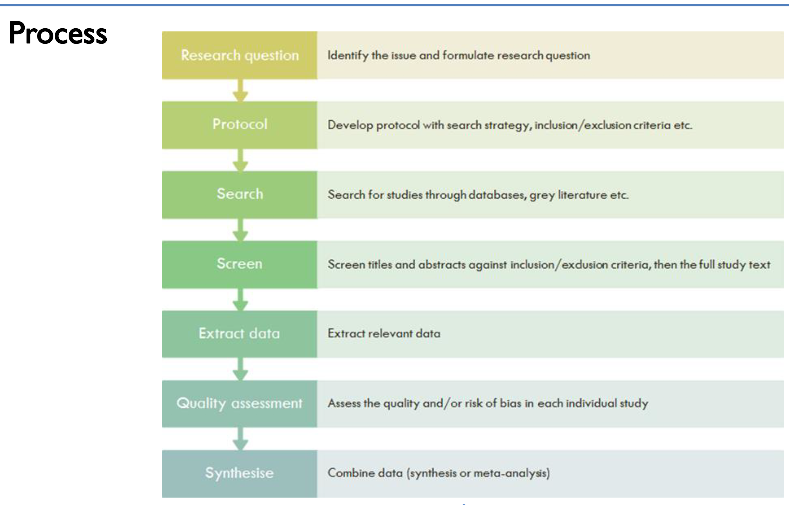

# Systematic Literature Review & Meta-Analysis
Evaluation of the effectiveness of interventions in persuading citizens’ COVID-19 compliance across 10 countries. 

# Project Showcase Notice
This repository contains code and materials for the purpose of showcasing the project. Please note that sensitive and official parts of the project have been either partially or totally removed to protect proprietary information and adhere to privacy and security guidelines.

Purpose
The content provided here is intended to demonstrate the capabilities, design patterns, and methodologies employed in the project. It is not meant for production use and may lack certain functionalities that are part of the full, official version.

Limitations
- **Sensitive Information**: Any sensitive information, including but not limited to private keys, credentials, and personal data, has been removed or anonymised.
- **Partial Functionality**: Some sections of the code may have been modified or omitted to ensure the security and privacy of the underlying system or data. As such, the repository may not represent the full functionality of the original project.
- **Showcase Only**: The provided code and documents are intended for viewing and demonstration purposes only.

